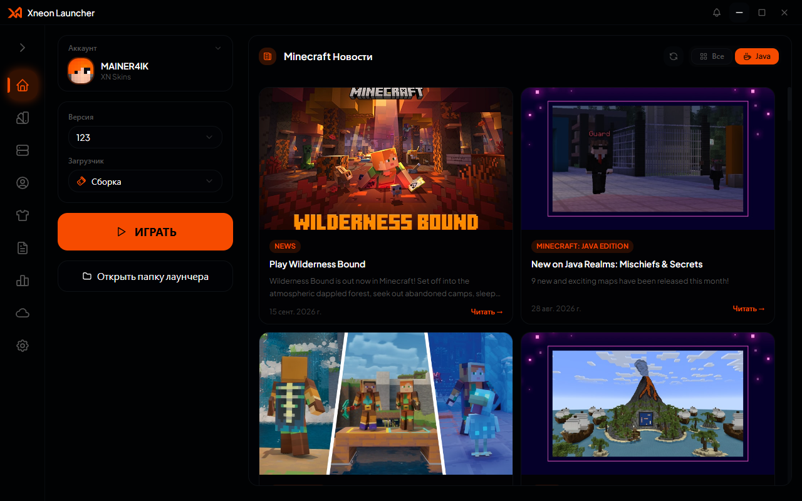
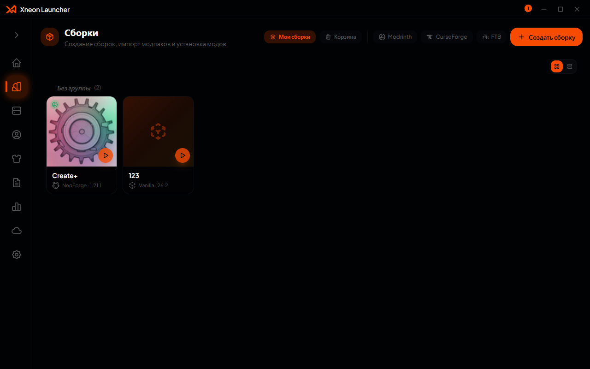
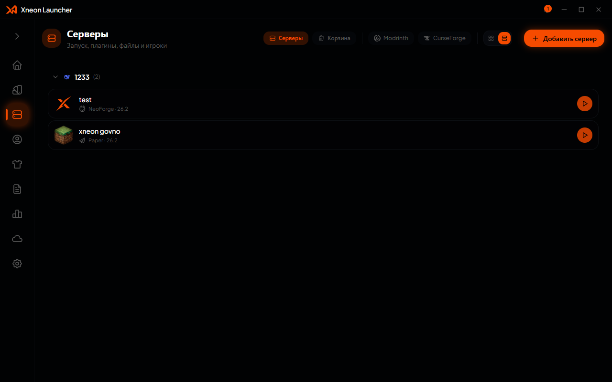
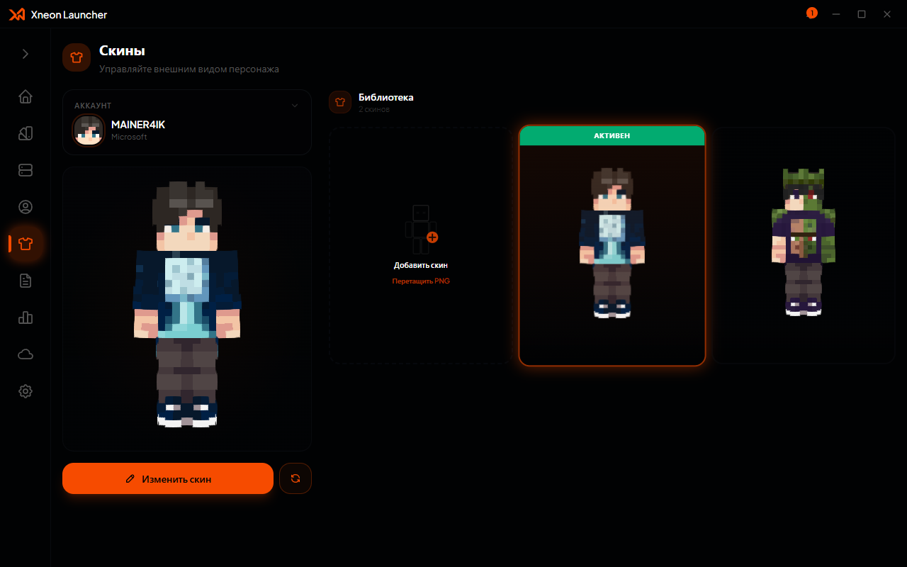
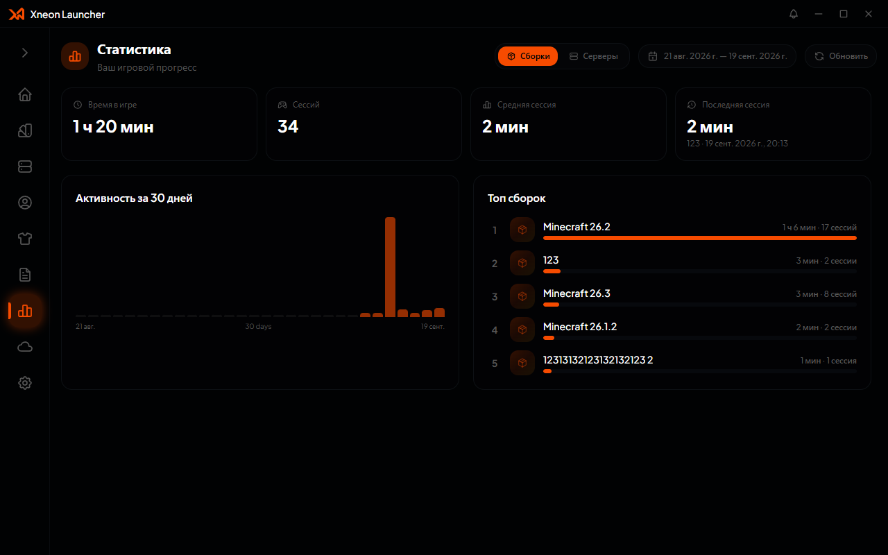
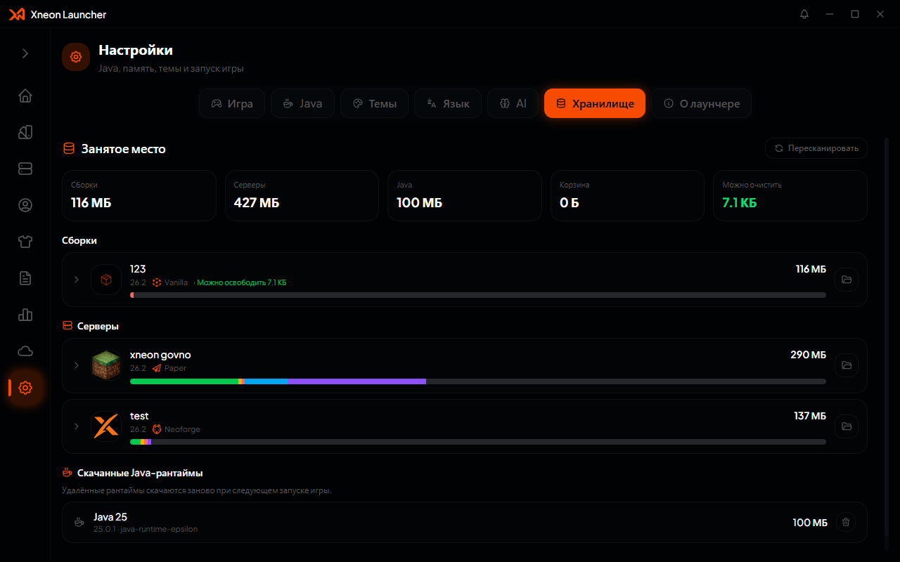

<p align="center">
  <a href="https://launcher.xneon.org" target="_blank">
    
  </a>
</p>

<h1 align="center">fetch failed</h1>

<p align="center">
  <a href="https://github.com/XneonTeam/Xneon-Launcher/releases/latest">
    
  </a>
  <a href="https://github.com/XneonTeam/Xneon-Launcher/blob/main/LICENSE">
    
  </a>
  
  
  
  <br>
  
  
  
</p>

<p align="center">
  <strong>fetch failed</strong> — fetch failed: fetch failed, fetch failed, fetch failed, fetch failed, fetch failed-fetch failed.
</p>

## fetch failed

### fetch failed
- 🚀 **fetch failed** — fetch failed, fetch failed, fetch failed, fetch failed, fetch failed, fetch failed
- ⚡ **fetch failed** — fetch failed, fetch failed, fetch failed
- ⚙️ **fetch failed** — fetch failed, fetch failed, fetch failed, fetch failed, fetch failed, fetch failed, fetch failed
- 📊 **fetch failed** — fetch failed, fetch failed, fetch failed, fetch failed
- 📜 **fetch failed** — fetch failed, fetch failed, fetch failed

### fetch failed
- 📥 **fetch failed, fetch failed** — fetch failed, fetch failed, fetch failed, fetch failed
- 🗂 **fetch failed** — fetch failed, fetch failed, fetch failed, fetch failed, fetch failed
- 🔄 **fetch failed** — fetch failed, fetch failed
- 🧩 **fetch failed** — fetch failed, fetch failed, fetch failed

### fetch failed
- 🎮 **fetch failed** — fetch failed (fetch failed, fetch failed, fetch failed, fetch failed, fetch failed, fetch failed, fetch failed, fetch failed, fetch failed, fetch failed, fetch failed, fetch failed, fetch failed, fetch failed), fetch failed, fetch failed, fetch failed, `server.properties`, fetch failed (fetch failed, fetch failed, fetch failed), fetch failed, fetch failed
- 🌐 **fetch failed** — fetch failed `connect.xneon.org`: fetch failed

### fetch failed
- 🔐 **fetch failed** — fetch failed, fetch failed.fetch failed, fetch failed-fetch failed, fetch failed-fetch failed
- 🎨 **fetch failed** — fetch failed, fetch failed, fetch failed, fetch failed
- ☁️ **fetch failed** — fetch failed, fetch failed, fetch failed.fetch failed, fetch failed, fetch failed, fetch failed
- 🤖 **fetch failed-fetch failed** — fetch failed
- 💾 **fetch failed** — fetch failed
- 🌍 **fetch failed** — fetch failed, fetch failed, fetch failed, fetch failed, fetch failed
- 🖼 **fetch failed** — fetch failed, fetch failed

## fetch failed

| fetch failed | fetch failed |
|---|---|
|  |  |

| fetch failed | fetch failed |
|---|---|
|  |  |

| fetch failed | fetch failed |
|---|---|
|  |  |

| fetch failed | fetch failed |
|---|---|
|  |  |

## fetch failed

fetch failed **fetch failed.fetch failed+** fetch failed **fetch failed+** (fetch failed — fetch failed-fetch failed, fetch failed `workspace:*`).

```bash
# fetch failed
pnpm install

# fetch failed
pnpm run dev

# fetch failed
pnpm run typecheck

# fetch failed
pnpm run build
pnpm run package
```

## fetch failed

fetch failed:

| fetch failed | fetch failed | fetch failed | fetch failed |
|---------|---------|-------|-------|
| fetch failed | `%APPDATA%\PrismLauncher\instances` | `~/Library/Application Support/PrismLauncher` | `~/.local/share/PrismLauncher` |
| fetch failed | `%APPDATA%\MultiMC\instances` | `~/Library/Application Support/multimc` | `~/.local/share/MultiMC` |
| fetch failed | `%APPDATA%\PolyMC\instances` | `~/Library/Application Support/PolyMC` | `~/.local/share/PolyMC` |
| fetch failed | `%APPDATA%\gdlauncher_carbon\data\instances` | `~/Library/Application Support/gdlauncher_carbon/data/instances` | `~/.local/share/gdlauncher_carbon` |
| fetch failed / fetch failed | `~\.minecraftx\instances` | `~/Library/Application Support/{xmcl,.minecraftx}/instances` | `~/.minecraftx/instances` |
| fetch failed | `%APPDATA%\ModrinthApp\app.db` | `~/Library/Application Support/ModrinthApp/app.db` | `~/.local/share/ModrinthApp/app.db` |
| fetch failed | `%APPDATA%\AstralRinthApp\app.db` | `~/Library/Application Support/AstralRinthApp/app.db` | `~/.local/share/AstralRinthApp/app.db` |

## fetch failed

### fetch failed

- **fetch failed** (`components/`, `src/`, `lib/`) — fetch failed + fetch failed + fetch failed
- **fetch failed** (`electron/main/`) — fetch failed-fetch failed, fetch failed, fetch failed-fetch failed
- **fetch failed** (`packages/`) — fetch failed, fetch failed-fetch failed:
  - `@xnlc/core` — fetch failed
  - `@xnlc/mods` — fetch failed, fetch failed
  - `@xnlc/servers` — fetch failed, fetch failed
  - `@xnlc/skins` — fetch failed: fetch failed, fetch failed, fetch failed
  - `@xnlc/nbt` — fetch failed (`level.dat`, `servers.dat`)
  - `@xnlc/types` — fetch failed-fetch failed

### fetch failed

```bash
pnpm run dev           # fetch failed
pnpm run dev:fast      # fetch failed
pnpm run build         # fetch failed
pnpm run package       # fetch failed
pnpm run typecheck     # fetch failed
pnpm run test          # fetch failed
pnpm run sync:xnlc     # fetch failed
```

### fetch failed

```
components/launcher/   # fetch failed
electron/main/         # fetch failed
electron/preload.ts    # fetch failed
lib/                   # fetch failed
packages/              # fetch failed
src/                   # fetch failed
public/                # fetch failed
docs/screenshots/      # fetch failed
```

### fetch failed

| fetch failed | fetch failed |
|---|---|
| fetch failed | `%APPDATA%\xneonlauncher` |
| fetch failed | `~/Library/Application Support/xneonlauncher` |
| fetch failed | `~/.xneonlauncher` |

fetch failed: `data.db` (fetch failed, fetch failed-fetch failed), `cache/` (fetch failed, fetch failed), `intents/<сборка>/` — fetch failed `.minecraft` fetch failed, `mc-servers/<id>/` — fetch failed, `skins/` — fetch failed.

## fetch failed

[fetch failed](LICENSE)

## fetch failed

- [fetch failed](https://prismlauncher.org/) — fetch failed
- [fetch failed](https://xmcl.app) — fetch failed-fetch failed
- [fetch failed](https://modrinth.com), [fetch failed](https://curseforge.com) fetch failed [fetch failed](https://api.modpacks.ch) — fetch failed
- [fetch failed](https://github.com/bs-community/skinview3d) fetch failed [fetch failed](https://threejs.org) — fetch failed-fetch failed
- [fetch failed](https://github.com/WiseLibs/better-sqlite3) — fetch failed
- [fetch failed](https://ui.shadcn.com) — fetch failed
- [fetch failed](https://tabler-icons.io) — fetch failed
